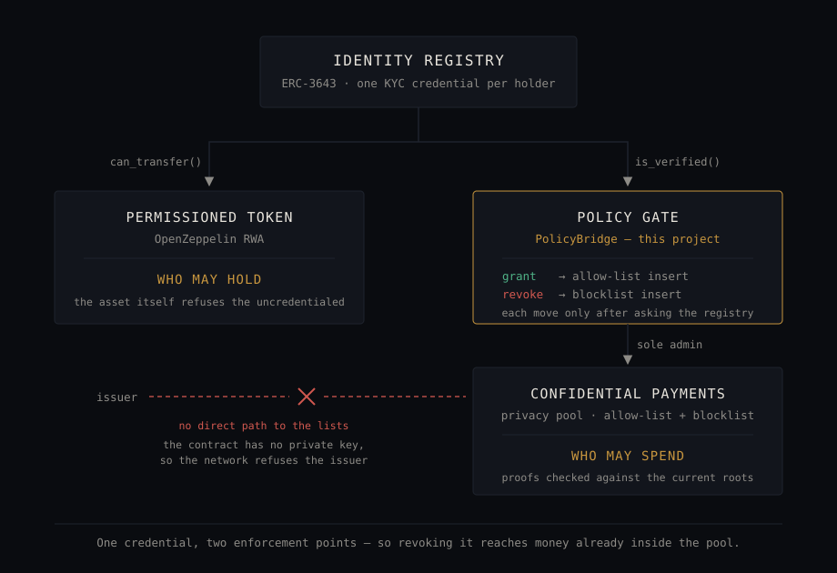

# Sigilo

**Confidential coupon payments for tokenized private credit, on Stellar.**

Enterprise / Compliance / RWA → [The demonstration](#the-demonstration).
Confidential-token and private-payment wallets → [The wallet](#the-wallet).

## For judges

The submission form held a repository and a video. Everything else it could not hold is one click from here:

| | |
|---|---|
| **Demo video**, and the argument it makes | [watch on Drive](https://drive.google.com/file/d/1hdKdjdJBrwp1TQSe635KDed2wif6lkwv/view) |
| **Run it yourself**, every click listed | [docs/DEMO.md](docs/DEMO.md) |
| **Architecture**, with the full reference run | [docs/ARCHITECTURE.md](docs/ARCHITECTURE.md) — every hash public |
| **The contract that is ours**, live on testnet | [`contracts/policy-bridge`](contracts/policy-bridge) · [`CD63ZKLY…`](https://stellar.expert/explorer/testnet/contract/CD63ZKLYQ2I3O3EJRAHIMPZQO424VGZHOG7INSY7IY3BYJZI2D6RHXRU) |
| **The two transactions carrying the whole argument** | [revoked holder withdraws anyway](https://stellar.expert/explorer/testnet/tx/c2f2264ad3d599dac9f7205c3c987568794d83785a7085dcce39de871805aeeb) · [again, re-credentialed](https://stellar.expert/explorer/testnet/tx/9cdd9675894941338fe0e5d053f4304f92622d0c10aa021e1877bc17c9733436) |
| **The wallet**, the same rail from the holder's end | [`app/wallet.html`](app/wallet.html) · [its run, with hashes](#the-wallets-own-run-with-hashes) · [its guarantees](docs/ARCHITECTURE.md#the-holders-wallet) |
| **Verify without trusting us** | [three commands](#verify-this-yourself) — no deployment, no keys, no us |

We revoked a holder's KYC credential and they withdrew from the privacy pool anyway: [`c2f2264a`](https://stellar.expert/explorer/testnet/tx/c2f2264ad3d599dac9f7205c3c987568794d83785a7085dcce39de871805aeeb), a real testnet transaction, published rather than deleted. That is the gap. A permissioned token and a confidential rail each enforce their own policy correctly and neither knows about the other, so revoking a credential does nothing to money already inside the pool.

Everyone else proves you are on the list. Sigilo proves you are *not* — and does it where the money already is.



Sigilo binds OpenZeppelin's ERC-3643 permissioned token to Nethermind's confidential payment pool through an original Soroban contract — [`contracts/policy-bridge`](contracts/policy-bridge), 368 lines of contract and 526 of tests. [Attribution and pinned commits](#what-is-ours-and-what-is-not). Testnet only.

Every coupon an issuer pays on a public ledger is a published treasury statement: who was paid, when, how much. Institutions raise this first when evaluating tokenized private credit, and the answer today is to accept it or leave the public chain. Sigilo pays those coupons confidentially, gates them with the same identity policy that gates the token, and lets a holder disclose one payment to an auditor without opening anything else.

---

## The demonstration

Reproduced on testnet, every hash public.

**A credential is enforced by the token.** A transfer to an address with no KYC claim is rejected on-chain; once the claim is issued, the same transfer goes through.

**A coupon cycle pays without publishing amounts.** Five holders, accrued from each entry date — not pro-rata, since positions are public and proportional coupons would be recoverable from one disclosed payment. The transaction declares only `invoke_host_function`; each recipient decrypts theirs locally.

**Revocation freezes, and the gap is visible first.** With the credential revoked in the register, the holder still withdrew ([`c2f2264a`](https://stellar.expert/explorer/testnet/tx/c2f2264ad3d599dac9f7205c3c987568794d83785a7085dcce39de871805aeeb)). After Sync, the same withdrawal was refused — *"user note key exists in non-membership tree"*.

**An auditor verifies one payment and learns nothing else.** No wallet, no storage, no privileged access. Raise the claimed amount by a digit and the verdict flips to Refused with `Proof: no` while the other checks pass — the interface says which guarantee broke.

### The run, with hashes

Every row is public.

| Step | Transaction |
|---|---|
| Policy gate — grant, allow-list insert | [`03f0676…`](https://stellar.expert/explorer/testnet/tx/03f067603a497e4ad5b5fba17c96610fed716ea95526e0aab530e4b839d23b4b) |
| Treasury funds the pool | [`fc76008…`](https://stellar.expert/explorer/testnet/tx/fc76008210daf6f64a1e254090a2204bc9850c50f4ea8029fb04267a9d914c02) |
| Confidential coupon payment | [`649c9d3…`](https://stellar.expert/explorer/testnet/tx/649c9d34848cdd9bfa8736f16e13b471e741c5268d26505a5a7a3a7ee6ffc922) |
| Policy gate — revoke, blocklist insert | [`2811a69…`](https://stellar.expert/explorer/testnet/tx/2811a6976e8bd2218eff9b16ad54c54d1126eeb1d721ea58d14c87294f92d2a8) |
| **Revoked holder withdraws — before sync** | [`c2f2264…`](https://stellar.expert/explorer/testnet/tx/c2f2264ad3d599dac9f7205c3c987568794d83785a7085dcce39de871805aeeb) |
| Re-credentialed holder withdraws | [`9cdd967…`](https://stellar.expert/explorer/testnet/tx/9cdd9675894941338fe0e5d053f4304f92622d0c10aa021e1877bc17c9733436) |

The bolded row is the one to open: a successful withdrawal by a holder already revoked. After syncing, it is refused.

### The wallet's own run, with hashes

Through [`app/wallet.html`](app/wallet.html) as `inv2`, private balance read before and after each step.

| Step | `#bal-private` | Transaction |
|---|---|---|
| Deposit 10 XLM into the pool | 387.2291667 → 397.2291667 | [`887123c…`](https://stellar.expert/explorer/testnet/tx/887123c358c9e0e6c7edd1dfd5ed4aff6216143fc1dcea30db3adbde57edae79) |
| **Private send, 3 XLM to `inv5`** | 397.2291667 → 394.2291667 | [`6443916…`](https://stellar.expert/explorer/testnet/tx/6443916a4efd27590b1216a10d444261da792d01c196f68fef6d3b1279f7f80a) |
| Withdraw 2 XLM to the public address | 394.2291667 → 392.2291667 | [`072394c…`](https://stellar.expert/explorer/testnet/tx/072394c8f7c6604ce26a07e8649155988583e05de24056fcd3fa816f8195588b) |

All three ran against the [superseded rail](docs/ARCHITECTURE.md#deployment-stellar-testnet) and are unaffected by its replacement. All return `"status":"SUCCESS"`. Searching the **decoded** XDR for the literal stroop amount finds it **11 times** in the deposit and **6** in the withdrawal — and **0 times** in the transfer. The two public rows are the control: value crossing the pool boundary is public by construction, so the transfer's zero is a measurement, not a broken search. (Grepping the *base64* response passes on every transaction ever made.) Method and structural checks: [docs/ARCHITECTURE.md](docs/ARCHITECTURE.md#the-wallets-own-run).

Full sequence and enforcement semantics: [docs/ARCHITECTURE.md](docs/ARCHITECTURE.md#reference-run). Step-by-step walkthrough: [docs/DEMO.md](docs/DEMO.md).

## The wallet

A confidential balance is only worth holding if you can prove one line of it. Hiding a balance is the easy part; opening exactly one payment out of it, to someone who holds no keys, is what makes the hiding usable — and it is the half most privacy wallets leave out.

**[`app/wallet.html`](app/wallet.html)** is the holder's side as its own page: the balance decrypted locally, a private send, a deposit, a withdrawal the policy gate can refuse, the payment history, the enrolment check — and a receipt for one payment, verified on the same page by a panel with no keys, no storage and no account.

**Nothing on the page is readable off it.** Amounts come out of note ciphertexts with the holder's key; an observer sees `invoke_host_function` and two addresses. **Disclosure is theirs to give** — the circuit requires the note's spending key, so not even the issuer can produce a receipt on their behalf, and each field is marked *proven* or *attested*. **The enrolment is checkable by the person it was done to:** the wallet re-derives the allow-list leaf from the holder's own key and compares. Each in full: [ARCHITECTURE.md](docs/ARCHITECTURE.md#the-holders-wallet).

**The withdrawal is where the policy gate is felt.** A blocklisted holder is refused client-side, before a transaction exists, over coupons they already held — *"user note key exists in non-membership tree"* — while the balance stays readable. The `revoke` behind it takes no key: the bridge reads the `Enrolment`, and the event names that same `note_key`. [The run, with hashes](docs/ARCHITECTURE.md#the-freeze-felt-from-the-wallet).

**What the wallet is not.** It opens five seeded holders from throwaway keys, not an account you own; a real one holds a single key and asks a browser extension for it. Proving is real work — roughly 9–13 s of Groth16 per operation, in a worker, and the page says so rather than looking hung.

## Verify this yourself

Nothing here asks to be taken on trust. Three checks run without our deployment, our keys, or us:

```bash
cd contracts/policy-bridge && cargo test   # 16 tests, led by the refusals:
                                           # revoke() fails while the registry still verifies (#3)
node tools/verify-receipt.mjs --self-test  # the vendored SDK loads outside a browser, and the
                                           # exact receipt schema the auditor accepts
node app/tools/key-gate.mjs                # the browser signer derives the same keys as the CLI,
                                           # per holder — the demo's wallets are not staged
```

`cargo test` names its own argument: `refuses_to_freeze_someone_still_in_good_standing` is the constraint nobody implements, because it costs the operator flexibility and buys nothing until an investor sues. Beside it, `a_decoy_holder_cannot_be_used_to_freeze_a_third_party` [found a real defect here](#the-trade-offs-behind-those-rows).

And the two transactions carrying the whole argument, on a public explorer, no tooling:

- [the revoked holder's withdrawal succeeding](https://stellar.expert/explorer/testnet/tx/c2f2264ad3d599dac9f7205c3c987568794d83785a7085dcce39de871805aeeb) — before the policy gate was told
- [the same holder withdrawing again after re-credentialing](https://stellar.expert/explorer/testnet/tx/9cdd9675894941338fe0e5d053f4304f92622d0c10aa021e1877bc17c9733436)

## What is hidden, and what is not

Confidentiality, not anonymity. Being precise about the boundary is the point.

| | Visible | Why, or how it is mitigated |
|---|---|---|
| Coupon amounts, in pool transactions | **no** | Pedersen commitments; recovered only by the recipient's key |
| Which holder received a given payment | **no** | on-chain; the issuer knows, from its own records |
| Addresses transacting with the pool | yes | inherent to the design — confidentiality, not anonymity |
| Token positions | yes | a securities register should be legible to a regulator; confidential balances are future work |
| Aggregate value the treasury funded into the pool | yes | mitigated by pre-funding in round amounts, decoupled from any cycle |
| **Membership of the allow-list** | **yes** | a cap table, not a mixer — see below |
| **This demo's amounts** | **recomputable** | the seed publishes the rate and the positions. In a real deployment the deal rate is the issuer's private data — that is the thing the confidential payments protect |

### The trade-offs behind those rows

Public membership, retroactive revocation, the leaf at `grant`, and the consent enrolment requires are each stated as what was traded for what in [ARCHITECTURE.md](docs/ARCHITECTURE.md#the-trade-offs-behind-those-rows). One belongs here — it is a negative result, not a design choice.

**The reasoning that is right at `grant` was wrong at `revoke`, and that one was a safety hole.** A wrong allow-list leaf only ever denied its own holder service. But freezing inserts a holder's *note key* into the blocklist, and `revoke` used to take that key as an argument — the credential check ran against the `holder` named in the call while the write acted on whatever key was passed, nothing joining them. An operator could pass the gate with an uncredentialed decoy of their own, hand it a credentialed holder's note key (public by design), and freeze an investor in good standing. Treating both cases as one liveness trade-off is how it went unnoticed. It is closed: `revoke` and `restore` take no key, reading the `Enrolment` written when the register approved that holder, and a reverse index refuses binding one holder's key to another (`NoteKeyBound`, #7). Test `a_decoy_holder_cannot_be_used_to_freeze_a_third_party` fails without that guard. The old bridge could not be upgraded in place — it owns its trees permanently, the same property that makes the gate real — so the fix meant [new trees and a new bridge](docs/ARCHITECTURE.md#deployment-stellar-testnet), with the pool re-pointed rather than redeployed. Old ids are superseded, not deleted.

## What is ours, and what is not

Judges here will see many demos on the same two libraries, so this is the line — drawn after you have seen what it produced.

**Not ours.** The privacy pool, its Groth16 circuits, the ASP contracts and the web SDK are Nethermind's [stellar-private-payments](https://github.com/NethermindEth/stellar-private-payments). The permissioned-token suite is OpenZeppelin's [RWA / ERC-3643 implementation](https://github.com/OpenZeppelin/stellar-contracts). Both Apache-2.0, unmodified, pinned by commit in [NOTICE](NOTICE).

**Ours.** [`contracts/policy-bridge`](contracts/policy-bridge) — 368 lines plus 526 of tests: the on-chain policy gate closing the gap this README opens with. To use it with your own registry and pool: [Using it in your own deployment](docs/ARCHITECTURE.md#using-it-in-your-own-deployment). Also ours: the coupon service, the three-role demo interface, the holder wallet, the local signer, and the deployment scripts.

It owns both lists and consults the registry before moving either, so an operator can neither invent a credential nor manufacture a freeze against an investor in good standing — enforced by `NotCredentialed` (#2), `StillCredentialed` (#3), the stored `Enrolment` `revoke` reads instead of taking a key, and `NoteKeyBound` (#7). Their attempt to reach the lists directly is refused by the network:

```
error: Missing signing key for account CCCVU6BZA4JRPZNYGCEMFYNV2DN3RJ676EY25NGMKSAMS4PFCRHE6JID
```

That account is the contract. It has no private key, and its only entrypoints check the registry.

## Running the demo

> ⚠️ Built for the [Stellar Builder Summit SP 26](https://bounties.grantfox.xyz/events/stellar-summit-sp-2026). **Testnet only**, on unaudited alpha dependencies. Not for real value.

Needs the Stellar CLI, Rust, Node 22+, `jq`, and clones of the two upstream repos at the pinned commits. First-time deployment, the pool's own instance, and the macOS clang fix are in [docs/DEMO.md](docs/DEMO.md#first-time-setup), followed by the click-by-click walkthrough.

## Built on

| | Commit | License |
|---|---|---|
| [NethermindEth/stellar-private-payments](https://github.com/NethermindEth/stellar-private-payments) | `461c1d0` | Apache-2.0 |
| [OpenZeppelin/stellar-contracts](https://github.com/OpenZeppelin/stellar-contracts) | `9b5ed96` | Apache-2.0 |
